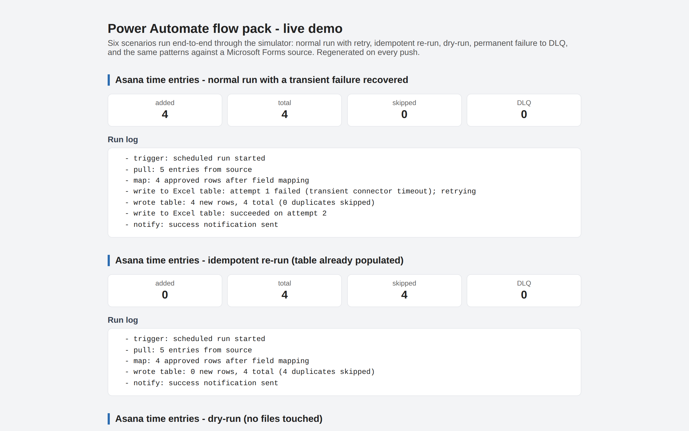
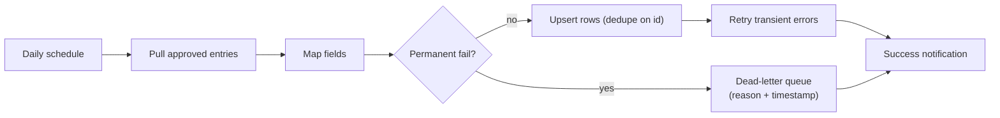

# Power Automate flow pack

[](https://github.com/derekgallardo01/power-automate-flow-pack/actions/workflows/ci.yml) [](LICENSE) [](#) [](https://codespaces.new/derekgallardo01/power-automate-flow-pack)

**Docs:** [Getting started](docs/getting-started.md) · [Architecture](docs/architecture.md) · [Customization](docs/customization.md) · [Evaluation](docs/evaluation.md) · [Diagrams](docs/diagrams.md) · [FAQ](docs/faq.md)

**Live demo:** [derekgallardo01.github.io/power-automate-flow-pack](https://derekgallardo01.github.io/power-automate-flow-pack/) — six scenarios run end-to-end (normal run with retry, idempotent re-run, dry-run, DLQ, plus the same patterns against a Microsoft Forms source), regenerated on every push.

[](https://derekgallardo01.github.io/power-automate-flow-pack/)

[Full-page capture (all 6 scenarios) →](docs/screenshots/01-overview-fullpage.png)


Reusable Power Automate patterns for Microsoft 365 automation — pull data on a
schedule, map fields, write it to an Excel table in SharePoint, with **retry**,
**de-duplication**, a **dead-letter queue**, **dry-run** mode, and a **run log**
baked in.

Includes an offline simulator that proves the logic without a tenant — run it
with `python sim/run.py` and watch a transient failure recover and an
idempotent re-run skip everything. The CLI exposes the DLQ + dry-run paths the
canned demo doesn't show.

```bash
python sim/run.py                          # transient failure → retry + idempotent re-run
python sim/cli.py --dry-run                # every step logged, nothing written
python sim/cli.py --fail-writes 1 --reset  # custom run with options
python evals/run.py                        # 9 end-to-end scenarios, CI-gating
python -m pytest sim/tests/ -q             # 10 unit tests
```

Stdlib-only Python, no tenant required to run any of this.

## Run in Docker

```bash
docker build -t power-automate-flow-pack .
docker run --rm power-automate-flow-pack                                       # scripted demo
docker run --rm power-automate-flow-pack python evals/run.py                   # Asana scenarios
docker run --rm power-automate-flow-pack python evals/run.py golden-forms.json sim/data/forms-responses.json sim/data/mapping-config-forms.json   # Forms scenarios
docker run --rm power-automate-flow-pack python sim/cli.py --dry-run           # dry-run mode
```

## Example: production scenario

**[examples/sync_run_demo.py](examples/sync_run_demo.py)** — Same flow code running across 4 scenarios: happy path / transient failures (retry succeeds) / permanent failure (DLQ catches it) / dry-run

```bash
python examples/sync_run_demo.py
```

## The problem it solves

A team had approved time entries in Asana but payroll needed them in an Excel
table in SharePoint — and someone was copying rows by hand every week. Naive
automations break in two predictable ways: they duplicate rows on re-runs, and
they fail silently on a transient timeout. **Permanent failures** are worse
still: a single bad row aborts the whole sync, so nothing lands until someone
hand-fixes the data. This pattern handles all three.



## Architecture in one paragraph

`run_sync` runs five steps in order: trigger → `load_json` (source + mapping) →
`map_entries` (field map + approved filter) → `write_table` (idempotent upsert
keyed on `mapping["key"]`, wrapped in `with_retry` which retries plain
`Exception` and propagates `PermanentError` immediately) → `write_dlq` (any
rows in `permanent_fail_ids` get appended to `dlq.json` with reason + UTC
timestamp). `dry_run=True` performs every step but writes nothing, with
`[DRY RUN]` markers on the run-log entries it would change. Full diagrams +
per-component notes: [docs/architecture.md](docs/architecture.md).

## Sample output

```text
=== Normal run with a transient failure recovered on retry ===
  - trigger: scheduled run started
  - pull: 5 entries from source
  - map: 4 approved rows after field mapping
  - write to Excel table: attempt 1 failed (transient connector timeout); retrying
  - wrote table: 4 new rows, 4 total (0 duplicates skipped)
  - write to Excel table: succeeded on attempt 2
  - notify: success notification sent
summary: {'added': 4, 'total': 4, 'skipped': 0, 'dlq_count': 0}
```

Captured run including idempotent re-run, dry-run, and a permanent-failure
→ DLQ example: [docs/sample-run.txt](docs/sample-run.txt).

## Evaluation

Two scenario sets ship in the repo to prove the pattern works on more than
one source:

- **Asana time entries** — 9 scenarios in [evals/golden.json](evals/golden.json) against [sim/data/asana_export.json](sim/data/asana_export.json).
- **Microsoft Forms responses** — 5 scenarios in [evals/golden-forms.json](evals/golden-forms.json) against [sim/data/forms-responses.json](sim/data/forms-responses.json) (different shape, different mapping config, same flow logic).

```bash
$ python evals/run.py
Eval (golden.json): 9/9 passed (100%)

$ python evals/run.py golden-forms.json sim/data/forms-responses.json sim/data/mapping-config-forms.json
Eval (golden-forms.json): 5/5 passed (100%)
```

How to add scenarios (real-world failure capture, throughput edges,
cross-feature interactions) is in [docs/evaluation.md](docs/evaluation.md).

## Customization

Six typical tuning points — source connector, dedup key, retry semantics
(what's transient vs permanent), DLQ destination, schedule cadence,
notifications — are walked through in
[docs/customization.md](docs/customization.md). Most are one-line edits in
`mapping-config.json` or [sim/flow.py](sim/flow.py).

## What's inside

| Path | Purpose |
|------|---------|
| [flows/](flows/) | Power Automate flow exports: `scheduled-sync`, `approval`, the reusable `error-handling` sub-pattern, and an example field-mapping config. |
| [import-guide.md](import-guide.md) | Build/import steps + a test-with-sample-data-first checklist. |
| [sim/flow.py](sim/flow.py) | The pattern: `run_sync`, `with_retry`, `write_table`, `write_dlq`, `RunLog`, `PermanentError`. |
| [sim/cli.py](sim/cli.py) | argparse wrapper: `--source/--mapping/--table`, `--fail-writes`, `--dry-run`, `--reset`. |
| [sim/run.py](sim/run.py) | Scripted two-run demo (transient failure recovered + idempotent re-run). |
| [sim/tests/](sim/tests/) | 10 pytest unit tests across mapping, retry, DLQ, dry-run. |
| [evals/](evals/) | 9 end-to-end scenarios + CI-gating runner. |
| [docs/](docs/) | Architecture, customization, and evaluation guides. |

## Taking it to a real tenant

Build the flow in Power Automate from the templates in [flows/](flows/),
following [import-guide.md](import-guide.md). Test against a sandbox source and
destination first, using the eval scenarios as your acceptance test list. Same
logic, same guarantees as the simulator.
