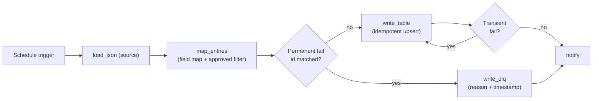
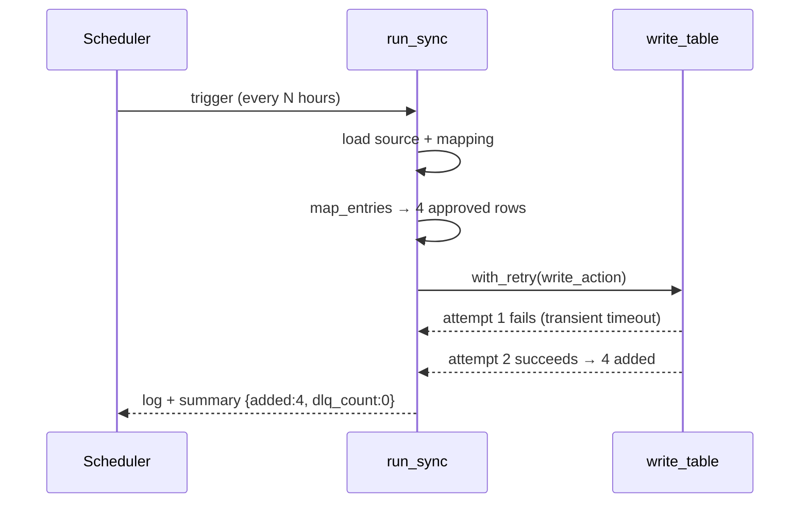

# Architecture

The scheduled-sync flow runs five steps in order: trigger → pull → map → write
(with retry) → notify. Two things make this pattern production-ready vs. a
naive automation: rows that **permanently** fail land in a dead-letter queue
instead of aborting the run, and every run can be exercised in **dry-run** mode
that performs every step except disk writes.

## Components



| Piece | Lives in | Job |
|-------|----------|-----|
| `run_sync` | [sim/flow.py](../sim/flow.py) | Orchestrates the five steps and threads the `RunLog` through them. |
| `map_entries` | [sim/flow.py](../sim/flow.py) | Applies the `target_column -> source_field` map and the approved filter. |
| `with_retry` | [sim/flow.py](../sim/flow.py) | Retries on plain `Exception` (transient); propagates `PermanentError` immediately. |
| `write_table` | [sim/flow.py](../sim/flow.py) | Idempotent upsert keyed on `mapping["key"]`; honors `dry_run`. |
| `write_dlq` | [sim/flow.py](../sim/flow.py) | Appends failed rows to `dlq.json` with reason + UTC timestamp. |
| `RunLog` | [sim/flow.py](../sim/flow.py) | Bullet-list run log; one entry per step. The trail every audit asks for. |
| Declarative flows | [flows/](../flows/) | Power Automate JSON exports of the same pattern; `import-guide.md` walks the build. |
| Eval harness | [evals/](../evals/) | 9 scenarios covering clean run, retry, idempotent rerun, partial dedup, DLQ, multi-row DLQ, dry-run. |
| CLI | [sim/cli.py](../sim/cli.py) | `argparse` wrapper: `--source/--mapping/--table`, `--fail-writes`, `--dry-run`, `--reset`. |

## Turn sequence — normal run



## Turn sequence — permanent failure to DLQ

```mermaid
sequenceDiagram
    participant T as Scheduler
    participant F as run_sync
    participant W as write_table
    participant D as write_dlq
    T->>F: trigger
    F->>F: load + map → 4 rows; t1 in permanent_fail_ids
    F->>W: with_retry(write 3 good rows)
    W-->>F: success → 3 added
    F->>D: write_dlq([t1])
    D-->>F: 1 row recorded with reason + timestamp
    F-->>T: log + summary {added:3, dlq_count:1}
```

## Why the design looks like this

- **Transient vs permanent is an exception type, not a config knob.** Connector
  timeouts, throttling, and 5xx responses raise plain `Exception` → retried.
  Schema-level rejection of a row (a `PermanentError`) propagates immediately so
  retry doesn't waste attempts on something that will never succeed.
- **DLQ is on by default (`on_failure="dlq"`).** A naive flow that aborts the
  whole run when one row is bad creates an operational nightmare: rerunning
  doesn't help, and no rows make it through until the bad one is fixed. The DLQ
  lets the good rows land and isolates the bad ones for human review.
- **`on_failure="raise"` exists for tests** that want to assert the propagation
  path. Don't use it in production unless your downstream truly can't tolerate
  partial writes.
- **`dry_run=True` writes nothing, logs everything.** Flagged with `[DRY RUN]`
  on the run-log entries it would change, so the diff between dry-run and real
  is exactly the files that would be touched.

## Where to look first if something goes wrong

| Symptom | Look here |
|---------|-----------|
| Same rows appearing multiple times in the table | `mapping["key"]` is the dedup column — make sure it's actually unique per logical record (and stable across runs). |
| Run keeps failing forever | The error being raised is being treated as transient. If it's actually permanent (4xx, schema error), raise `PermanentError` from your write action instead. |
| DLQ growing unexpectedly | Inspect `dlq.json` — each entry has a `reason`. If the reason isn't actionable, expand the message in `run_sync` so future failures are diagnosable. |
| Dry-run wrote to disk | Check `write_table` and `write_dlq` are both guarded by `dry_run`; both must respect the flag. |
| CLI command does nothing visible | Power Automate exports are in [flows/](../flows/); the simulator runs locally. `python sim/cli.py --help` lists the options. |
