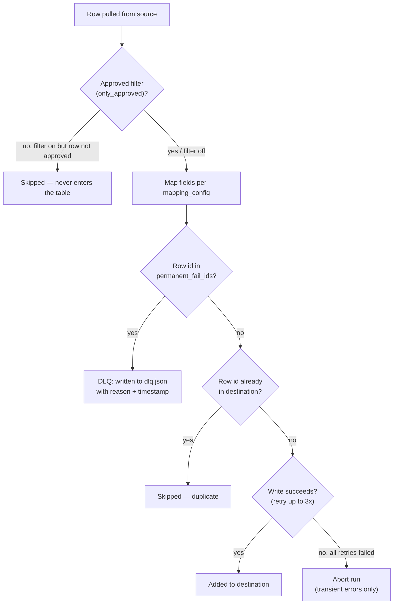
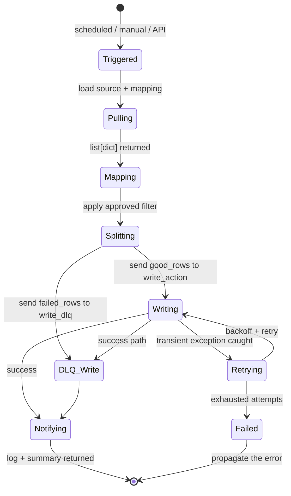
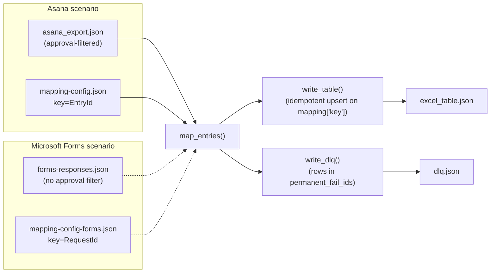

# Diagrams

Beyond the inline ones in [architecture.md](architecture.md).

## 1. Decision tree — what happens to each row



## 2. Sequence — happy run with transient failure recovered

```mermaid
sequenceDiagram
    autonumber
    participant T as Scheduler
    participant F as run_sync
    participant Map as map_entries
    participant WR as with_retry
    participant WT as write_table

    T->>F: trigger (06:00 daily)
    F->>F: load source (5 entries) + mapping
    F->>Map: map_entries(entries, mapping)
    Map-->>F: 4 approved rows (1 unapproved skipped)
    F->>WR: with_retry(write_action, label="write")
    WR->>WT: attempt 1
    WT-->>WR: raise RuntimeError("transient timeout")
    WR->>WR: log "attempt 1 failed; retrying"
    WR->>WT: attempt 2
    WT-->>WR: {added: 4, total: 4, skipped: 0}
    WR->>WR: log "succeeded on attempt 2"
    WR-->>F: result
    F-->>T: log + {added:4, total:4, dlq_count:0}
```

## 3. Sequence — permanent failure routed to DLQ

```mermaid
sequenceDiagram
    autonumber
    participant T as Scheduler
    participant F as run_sync
    participant Map as map_entries
    participant WT as write_table
    participant DQ as write_dlq

    T->>F: trigger
    F->>F: load + map → 4 rows
    F->>F: permanent_fail_ids=["t1"] → split:<br/>3 good rows, 1 failed_row<br/>(with reason + ISO timestamp)
    F->>WT: write 3 good rows
    WT-->>F: {added: 3, total: 3, skipped: 0}
    F->>DQ: write_dlq([failed_row])
    DQ-->>F: dlq_count = 1
    F-->>T: log + {added:3, total:3, dlq_count:1}
    Note over F,T: Run completes successfully<br/>3 good rows landed; bad row in DLQ for human review
```

## 4. State — run lifecycle



## 5. Data flow — across source variants


